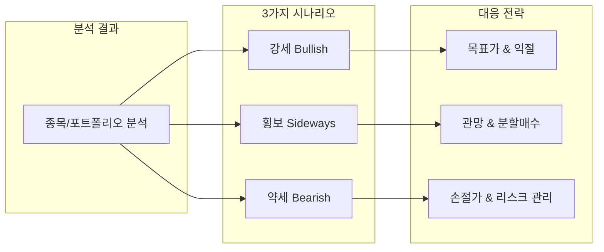
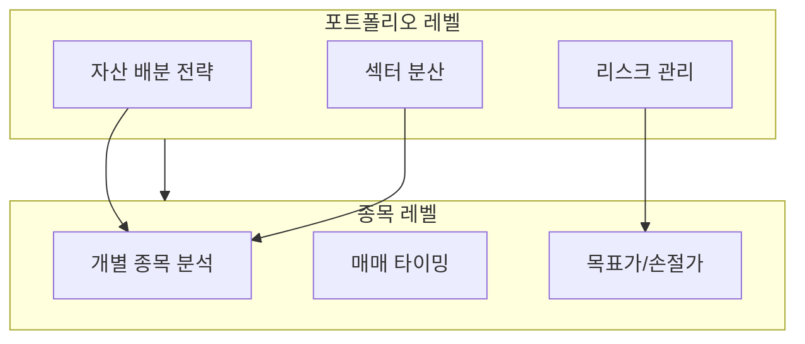
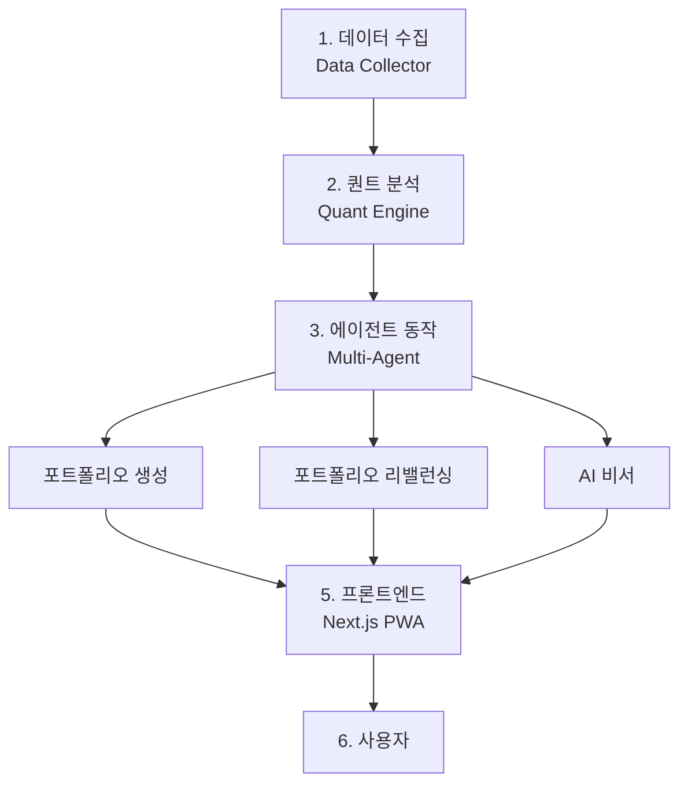
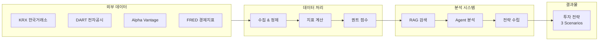
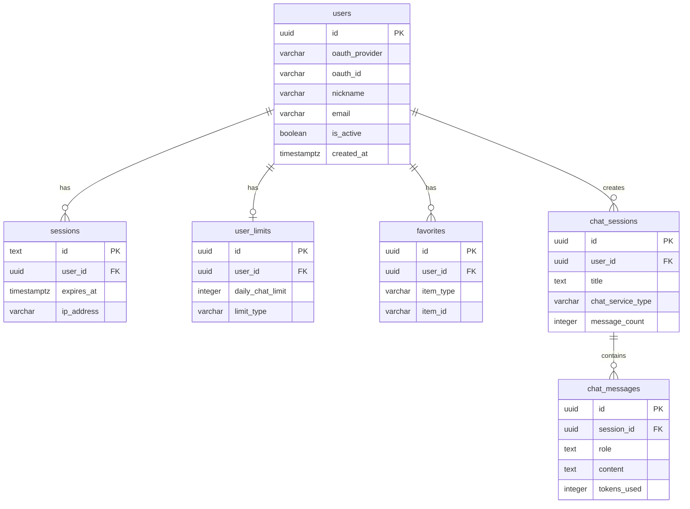
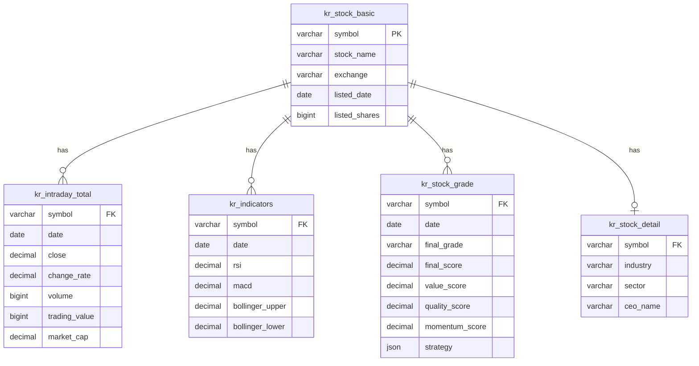
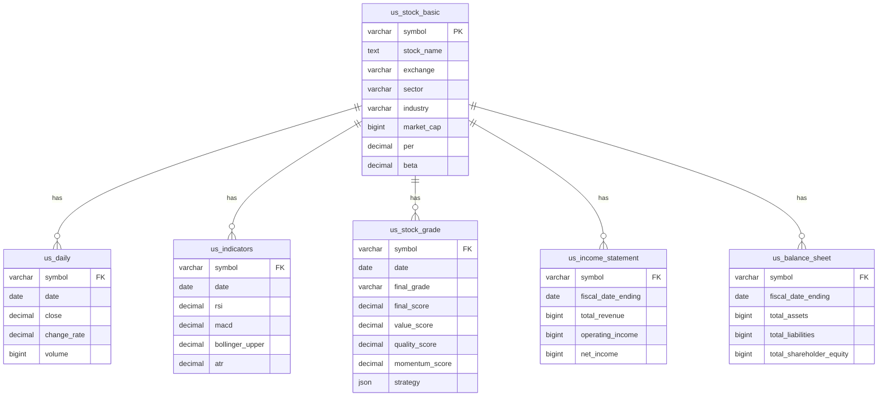
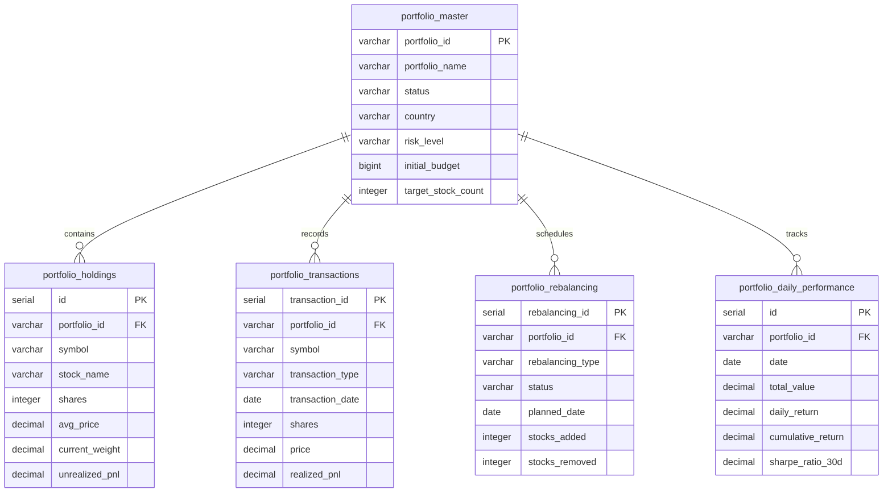

# 떡상 - Project Overview

## 포트폴리오 운영 시나리오 기반 주식 투자 전략 서비스

---

## 목차

- [서비스 소개](#서비스-소개)
- [핵심 차별점](#핵심-차별점)
- [시스템 아키텍처](#시스템-아키텍처)
- [데이터베이스 스키마](#데이터베이스-스키마)
- [프로젝트 구조](#프로젝트-구조)
- [기술 스택](#기술-스택)
- [라이선스](#라이선스)

---

## 서비스 소개

### 타겟 유저

**투자 경험이 있지만 전략 수립이 어려운 개인 투자자**

- 주식 투자 경험은 있지만 체계적인 투자 전략이 부족한 투자자
- 종목 발굴부터 매매 타이밍까지 종합적인 가이드가 필요한 투자자
- 감정적 투자에서 벗어나 데이터 기반 투자를 원하는 투자자

### 문제 정의

| 문제 | 설명 |
|------|------|
| **정보 과부화** | 수많은 투자 정보 속에서 신뢰할 수 있는 분석 선별의 어려움 |
| **전략 부재** | 매수는 했지만 언제 팔아야 할지 모르는 상황 반복 |
| **감정적 매매** | 공포와 탐욕에 휩쓸려 손실 확대 |
| **시간 부족** | 직장인이 시장을 실시간으로 모니터링하기 어려움 |

### 솔루션

> **"시나리오 기반 투자 전략 결론 -> 설명 -> 근거" 구조의 시나리오 기반 투자 전략 제공**

| 단계 | 설명 |
|------|------|
| **결론** | 명확한 투자 판단 (매수/매도/관망) |
| **설명** | 판단의 이유와 논리적 근거 |
| **근거** | 데이터와 분석 결과 (차트, 퀀트 분석, 정성적 데이터 분석) |

---

## 핵심 차별점

### 1. 3가지 시나리오 전략

모든 분석에 **강세/횡보/약세** 3가지 시나리오별 대응 전략 제공

| 시나리오 | 제공 정보 |
|----------|-----------|
| **강세 (Bullish)** | 발생 확률, 목표가, 익절 전략 |
| **횡보 (Sideways)** | 발생 확률, 박스권 범위, 분할매수 전략 |
| **약세 (Bearish)** | 발생 확률, 손절가, 리스크 관리 전략 |

### 2. 이중 분석 체계

**포트폴리오 레벨**과 **종목 레벨** 두 가지 관점에서 분석

| 레벨 | 분석 내용 |
|------|-----------|
| **포트폴리오** | 전체 자산 배분, 섹터 분산, 리밸런싱 전략 |
| **종목** | 개별 종목 매수/매도 판단, 목표가, 손절가 |

### 3. AI 기반 분석 시스템

| 기능 | 설명 |
|------|------|
| **AI 비서** | 투자 전략 질문에 대한 실시간 답변 (RAG + Text-to-SQL) |
| **Multi-Agent** | 시장 분석, 종목 리서치, 전략 수립을 전문 에이전트가 분담 |
| **퀀트 분석** | 73개 전략, 19개 시장 상태 기반 멀티팩터 점수 산출 |

### 4. 분석 대상

| 시장 | 거래소 | 종목 수 |
|------|--------|---------|
| **한국** | KOSPI, KOSDAQ | ~2,500+ |
| **미국** | NASDAQ, NYSE | ~4,500+ |

---

## 시스템 아키텍처

### 전체 구조

### 데이터 흐름

---

## 데이터베이스 스키마

PostgreSQL 기반 4개 레이어로 구성된 데이터 모델입니다.

### 회원/서비스

### 한국 주식

### 미국 주식

### 포트폴리오

---

## 프로젝트 구조

**떡상**은 6개의 독립적인 저장소로 구성된 멀티레포 아키텍처입니다.

| 저장소 | 설명 | 기술 스택 |
|--------|------|-----------|
| [**alphafolio_client-api**](https://github.com/vinjung/alphafolio_client-api) | Frontend (PWA) & Chat API Server | Next.js 15, React 19, FastAPI, LangGraph |
| [**alphafolio_data**](https://github.com/vinjung/alphafolio_data) | 데이터 자동 수집 & 지표 계산 | FastAPI, asyncpg, Cloud Scheduler |
| [**alphafolio_chat**](https://github.com/vinjung/alphafolio_chat) | 주식 투자 전략 전문 LLM (RAG) | LangChain, LangGraph, ChromaDB |
| [**alphafolio_quant**](https://github.com/vinjung/alphafolio_quant) | 멀티팩터 퀀트 분석 엔진 | NumPy, Pandas, 73 Strategies |
| [**alphafolio_stock_agent**](https://github.com/vinjung/alphafolio_stock_agent) | 종목 투자 전략 Multi-Agent AI | LangGraph, Task-driven Architecture |
| [**alphafolio_portfolio**](https://github.com/vinjung/alphafolio_portfolio) | 포트폴리오 생성 & 리밸런싱 엔진 | Risk Parity, VaR Management |

### 각 저장소별 핵심 기능

<b>alphafolio_client-api</b> - Frontend & Chat API

**Frontend (Client)**
- Next.js 15 App Router + React 19
- Mobile-First PWA
- Zustand 상태 관리
- Kakao OAuth 인증

**Chat API Server**
- FastAPI + LangGraph StateGraph
- Redis Stream 기반 SSE/WebSocket
- PostgreSQL Checkpointer (대화 메모리)

<b>alphafolio_data</b> - Data Collector

- 한/미 주식 시장 데이터 자동 수집
- Google Cloud Scheduler 기반 16개 스케줄 작업
- 52개 이상 테이블 관리 (한국 17개, 미국 35개)
- 기술적 지표 자동 계산 (RSI, MACD, 볼린저밴드 등)

<b>alphafolio_chat</b> - RAG LLM

- 3-Layer RAG Pipeline (Query Planning -> Retrieval -> Answer)
- Text-to-SQL (자연어 -> SQL 변환)
- ChromaDB 벡터 검색
- 투자 전략 특화 프롬프트

<b>alphafolio_quant</b> - Quant Engine

- 4대 팩터: Value, Quality, Momentum, Growth
- 73개 세부 전략
- 19개 시장 상태 분류
- IC 기반 동적 가중치 조절

<b>alphafolio_stock_agents</b> - Multi-Agent

- LangGraph 기반 Task-driven 아키텍처
- 3개 전문 에이전트:
  - Market Regime Agent (시장 국면 분석)
  - Stock Research Agent (종목 리서치)
  - Analysis Agent (전략 수립)

<b>alphafolio_portfolio</b> - Portfolio Engine

- 7단계 포트폴리오 생성 파이프라인
- Risk Parity 비중 배분
- VaR 한도 관리
- 섹터/시가총액 분산

---

## 기술 스택

### Backend

| 구분 | 기술 |
|------|------|
| **Language** | Python 3.11+ |
| **Framework** | FastAPI |
| **Database** | PostgreSQL (asyncpg) |
| **Vector DB** | ChromaDB |
| **Cache/Stream** | Redis |
| **AI Framework** | LangChain, LangGraph |
| **LLM** | Claude (Anthropic) |

### Frontend

| 구분 | 기술 |
|------|------|
| **Language** | TypeScript 5.0+ |
| **Framework** | Next.js 15 (App Router) |
| **UI Library** | React 19 |
| **State** | Zustand |
| **Styling** | Tailwind CSS |
| **ORM** | Drizzle ORM |

### Infrastructure

| 구분 | 기술 |
|------|------|
| **Hosting** | Railway |
| **Scheduler** | Google Cloud Scheduler |
| **Streaming** | SSE, WebSocket |

### Data Sources

| 소스 | 데이터 |
|------|--------|
| **KRX** | 한국 주식 시세, 투자자 동향 |
| **DART** | 재무제표, 기업 공시 |
| **Alpha Vantage** | 미국 주식 시세, 재무제표 |
| **FRED** | 미국 경제 지표 |
| **한국은행** | 한국 경제 지표 |

---

## 라이선스

**All Rights Reserved**

이 프로젝트의 모든 권리는 저작권자에게 있습니다.

- 본 코드의 복제, 배포, 수정, 상업적/비상업적 사용을 금지합니다.
- 채용 검토 목적의 열람만 허용됩니다.
- 무단 사용 시 법적 책임을 물을 수 있습니다.

문의: 저장소 소유자에게 연락해 주세요.
