# [떡상 - Project Overview](https://www.dducksang.com)

## AI Investment OS

---

## 목차

- [AI Investment OS](#ai-investment-os)
- [핵심 차별점](#핵심-차별점)
- [시스템 아키텍처](#시스템-아키텍처)
- [데이터 파이프라인](#데이터-파이프라인)
- [AI 채팅 시스템](#ai-채팅-시스템)
- [퀀트 분석 엔진](#퀀트-분석-엔진)
- [포트폴리오 엔진](#포트폴리오-엔진)
- [종목 투자 전략 Multi-Agent](#종목-투자-전략-multi-agent)
- [데이터베이스 스키마](#데이터베이스-스키마)
- [프로젝트 구조](#프로젝트-구조)
- [기술 스택](#기술-스택)
- [라이선스](#라이선스)

---

## AI Investment OS

### The Operating System for Retail Capital

AI Investment OS는 개인 투자자를 위한
**설명 가능한(Explainable) 적응형 퀀트 기반 투자 운영체제**입니다.

> 우리는 투자 정보를 제공하지 않습니다.
> 우리는 **개인 자본을 구조적으로 운영**합니다.

### 1. Service Overview

AI Investment OS는 다음을 통합합니다:

- **Market-Aware Adaptive Quant Engine**
- 전략 자동 생성 및 리밸런싱 설계
- 리스크 예산 자동 조정
- 대화형 인터페이스 기반 포트폴리오 설계
- 사용자 승인 기반 반자동 실행 구조

> 이 시스템은 하나의 펀드가 아닙니다.
> 각 사용자의 독립 계좌 위에서 작동하는 **분산형 투자 OS**입니다.

### 2. Problem Definition

**개인 투자에는 '운영체제'가 없다**

현재 시장에는 리서치 리포트, 데이터 플랫폼, 뉴스 서비스, 자동매매 툴, 유튜브/커뮤니티 분석이 존재합니다.
그러나 이들은 모두 **정보 제공자**입니다. 최종 결정과 리스크는 개인이 감당해야 합니다.

**구조적 문제**

| 문제 | 설명 |
|------|------|
| **정보 과잉** | 의사결정 피로 |
| **전략의 단편화** | 일관성 없는 투자 판단 |
| **리스크 관리 부재** | 감정 개입, 일관성 없는 손절/익절 |
| **레짐 변화 대응 불가** | 시장 국면 전환에 대한 구조적 대응 부재 |

> 결과적으로 개인은 질문을 반복합니다:
> **"그래서 지금 내 자본은 어떻게 운영되어야 하는가?"**

### 3. Solution: AI Investment OS

> 우리는 도구가 아니라 **운영 구조**를 제공합니다.

**Core Architecture**

**1. Explainable Adaptive Quant Engine**

- 4-Factor Multi-Factor 구조
- 동적 가중치 조정
- Market Regime 분류
- 팩터 상관관계 반영
- 리스크 예산 자동 조절

모든 의사결정은 설명 가능합니다: 종목 편입 근거, 팩터 기여도, 레짐 판단 근거, 리스크 계산 방식.

> 우리는 블랙박스를 사용하지 않습니다.

**2. Capacity-Aware Design (AUM Dilution 방지 구조)**

기관형 전략의 문제는 자본 규모가 커질수록 알파가 희석된다는 점입니다.

AI Investment OS는:

- 개인 자본 (소형 AUM) 최적화
- 독립 계좌 기반 분산 실행
- 유동성 필터 자동 조정
- 전략 수용 가능 자본(capacity) 추정
- 실행 시점 분산

> 확장은 자본의 집합이 아니라 **사용자 수의 증가**입니다.

**3. Strategy Diversification Layer**

쏠림 방지를 위해:

- 멀티 전략 구조
- 사용자 리스크 프로파일 기반 전략 조합
- Popularity Pressure Control (과밀도 감지 시 자동 조정)
- Dynamic Universe Expansion

> 우리는 알파를 복제하지 않습니다.
> 우리는 **알파를 분산**시킵니다.

**4. Semi-Automated Execution**

- 포트폴리오 자동 설계
- 리밸런싱 자동 제안
- 리스크 경고
- 사용자 승인 기반 실행

> 완전 자동이 아닌 **통제된 자동화(Controlled Automation)**를 지향합니다.

### 4. Target Users

**Initial Target**

- 한국 및 미국 개인 투자자 (초보 ~ 중수)
- 바쁜 직장인
- 투자 프로세스를 구조화하고 싶은 사용자
- 감정 개입을 줄이고 싶은 사용자

**Expansion Target**

- 멀티 전략 운용을 원하는 고수 투자자
- 계량적 리스크 관리에 관심 있는 사용자

### 5. Technology Roadmap

| Phase | 단계 | 내용 |
|-------|------|------|
| **Phase 1** | 인프라 구축 | 한국/미국 퀀트 엔진 + AI 비서 v1 / Strategy OS |
| **Phase 2** | 초개인화 완성 | 멀티 전략 기반 유저별 맞춤 전략 / Behavior Learning OS |
| **Phase 3** | UX 혁신 | 대화형 자산 관리 (Conversational UX) / Interface OS, Execution OS |
| **Phase 4** | 글로벌 확장 | 미국 직접 진출 및 글로벌 자산 배분 / Data OS |

> 우리는 전략을 생성하는 AI가 아니라
> **전략을 진화시키는 엔진**을 구축합니다.

### 6. Philosophy

우리는 펀드가 아닙니다.
우리는 브로커리지도 아닙니다.
우리는 분석 툴도 아닙니다.

**우리는 개인 자본 위에서 작동하는 투자 운영체제입니다.**

> 그리고 우리의 목표는 단순합니다.
> **의사결정 피로감의 종말.**

---

## Phase 1 핵심 차별점

### 1. 3가지 시나리오 전략

모든 분석에 **강세/횡보/약세** 3가지 시나리오별 대응 전략 제공

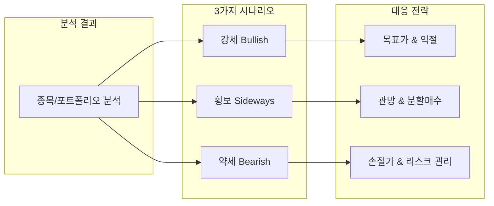

| 시나리오 | 제공 정보 |
|----------|-----------|
| **강세 (Bullish)** | 발생 확률, 목표가, 익절 전략 |
| **횡보 (Sideways)** | 발생 확률, 박스권 범위, 분할매수 전략 |
| **약세 (Bearish)** | 발생 확률, 손절가, 리스크 관리 전략 |

### 2. 이중 분석 체계

**포트폴리오 레벨**과 **종목 레벨** 두 가지 관점에서 분석

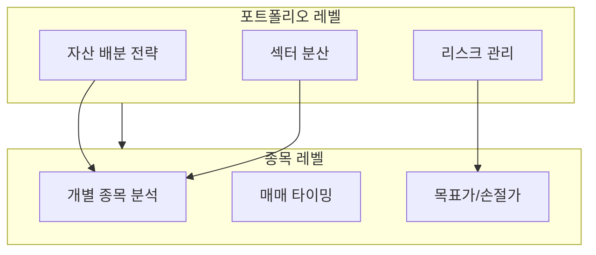

| 레벨 | 분석 내용 |
|------|-----------|
| **포트폴리오** | 전체 자산 배분, 섹터 분산, 9가지 트리거 기반 자동 리밸런싱, VaR/CVaR 리스크 관리 |
| **종목** | 개별 종목 매수/매도 판단, 목표가, 손절가, 멀티 에이전트 AI 투자 전략 |

### 3. AI 기반 분석 시스템

| 기능 | 설명 |
|------|------|
| **AI 비서** | 투자 전략 질문에 대한 실시간 답변 (Hybrid Query Router + Text-to-SQL + RAG + Fine-tuned SQL) |
| **Stock Agent** | 종목별 투자 전략을 3-에이전트 협업으로 생성 (Task-driven, Data/Narrative 분리) |
| **퀀트 분석** | KR 73개 전략 + US Factor Interaction + 3대 Engine 기반 멀티팩터 점수 산출 |
| **포트폴리오 리밸런싱 리포트** | LangGraph 3-에이전트가 리밸런싱 결과를 4섹션 리포트로 자동 생성 |
| **일일 추천** | 시장별 Top 3 종목 추천 (리스크 레벨별) |

### 4. 분석 대상

| 시장 | 거래소 | 종목 수 |
|------|--------|---------|
| **한국** | KOSPI, KOSDAQ | ~2,700+ |
| **미국** | NASDAQ, NYSE | ~4,500+ |

---

## 시스템 아키텍처

### 전체 구조

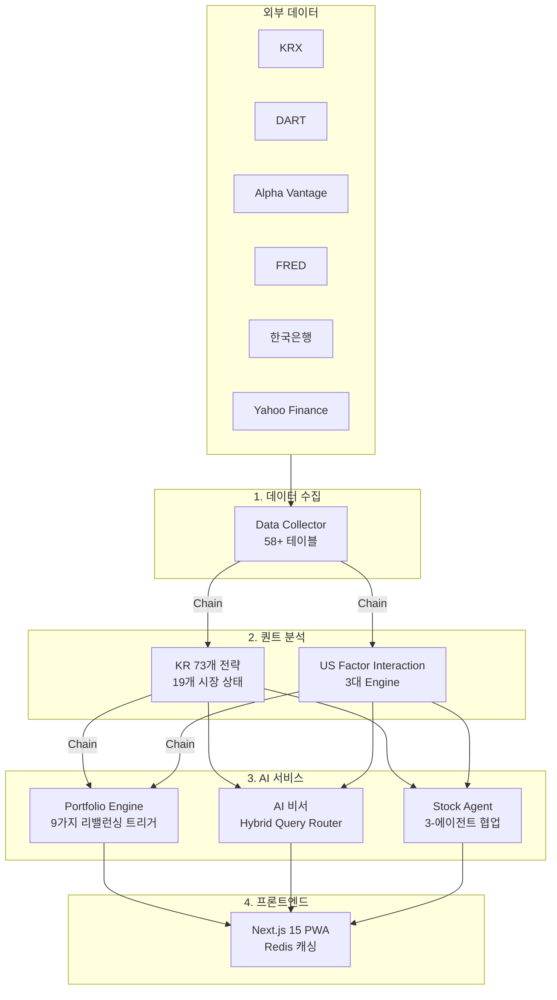

### 자동화 파이프라인

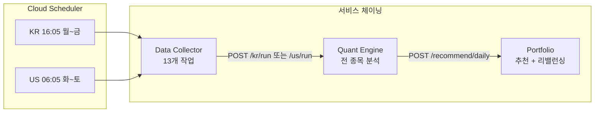

---

## 데이터 파이프라인

### 데이터 수집 (Data Collector)

Cloud Scheduler 기반 자동 수집 시스템으로 **58개+ 테이블**을 관리합니다.

| 시장 | 테이블 수 | 주요 데이터 |
|------|----------|-------------|
| **한국** | 21개 | 시세, 투자자 매매동향, 프로그램매매, 외국인 보유, 벤치마크, 재무제표, 경제지표, 리서치 리포트 |
| **미국** | 34개 | 시세, 기술지표 15종, 재무제표 3종, 옵션(GEX), 매크로(VIX/MOVE/달러/신용스프레드/GDP/PMI), 내부자거래, 어닝캘린더 |
| **공통** | 3개 | 시장지수, 환율, 거래일 캘린더 |

### 일일 수집 스케줄

| 시장 | 시간 (KST) | 작업 수 | 주요 작업 |
|------|-----------|---------|-----------|
| **KR 장중** | 09:30~16:00 (30분 간격) | 2개 | 실시간 시세, 상세 데이터 |
| **KR 장마감** | 16:05 | 13개 | 투자자동향, 외국인, 지표 계산, 경제지표, 리서치 |
| **US** | 06:05 | 13개 | 시세, ETF, 옵션, 매크로, 기술지표, 뉴스, 내부자거래 |

---

## AI 채팅 시스템

### Hybrid Query Router (v3 아키텍처)

LangGraph 기반 **16노드 조건부 워크플로우**로 사용자 질문을 분석합니다.

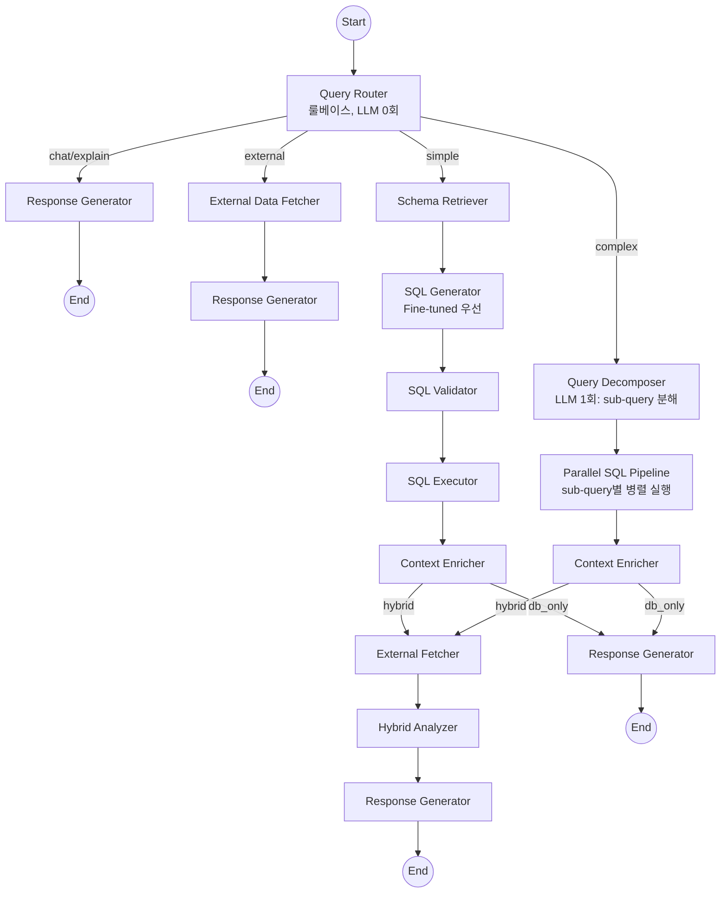

### 아키텍처 진화

| 버전 | 구조 | 응답 시간 | SQL 1회 통과율 |
|------|------|----------|---------------|
| v1 | 직렬 파이프라인 (5-8회 순차 LLM) | 25-70초 | ~60% |
| v2 | Query Decomposition (3 step) | 10-20초 | ~90% |
| **v3 (현재)** | Hybrid Query Router (simple→FT / complex→QD) | **2-20초** | **~90%+** |

### 핵심 기술

| 기능 | 설명 |
|------|------|
| **Hybrid Query Router** | 룰베이스(LLM 0회)로 simple/complex/chat/external 4-way 라우팅 |
| **Fine-tuned SQL** | GPT-4.1-mini 기반 695개 학습 데이터, 테이블 5개 이하 시 자동 선택, 실패 시 Claude Fallback |
| **다층 RAG** | Schema RAG (57개 테이블) + Few-Shot RAG (211개 예제) + Term Mapper (262개 매핑) |
| **종목명 해석** | 5단계 캐스케이딩 매칭 (정확→별칭→부분→퍼지→LLM, rapidfuzz 자모 분해) |
| **시장별 캐싱** | KR 장중 30분 / 장마감 다음 개장까지 / US 다음 08:00까지 |
| **외부 API** | Naver 뉴스, DART 전자공시, Serper 웹 검색 (Graceful Degradation) |
| **BOTH 마켓** | sub-query별 마켓 분리로 KR+US 통합 검색 구조적 해소 |

---

## 퀀트 분석 엔진

한국/미국 약 **7,000+ 종목**을 일괄 분석하여 투자 등급(강력 매수 ~ 강력 매도)을 산출합니다.

### 한국 모델

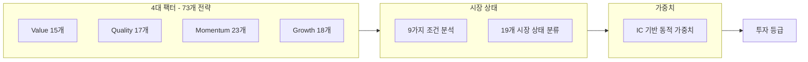

| 팩터 | 전략 수 | 주요 전략 |
|------|---------|-----------|
| **Value** | 15개 | Magic Formula, EV/EBITDA, 순자산할인, 주주환원율 |
| **Quality** | 17개 | ROE 일관성, 영업마진, 이자보상배율, 현금흐름 |
| **Momentum** | 23개 | 가격 모멘텀, RSI, MACD, 외국인 순매수 |
| **Growth** | 18개 | 매출/EPS/영업이익 성장률, R&D 투자 |

### 미국 모델

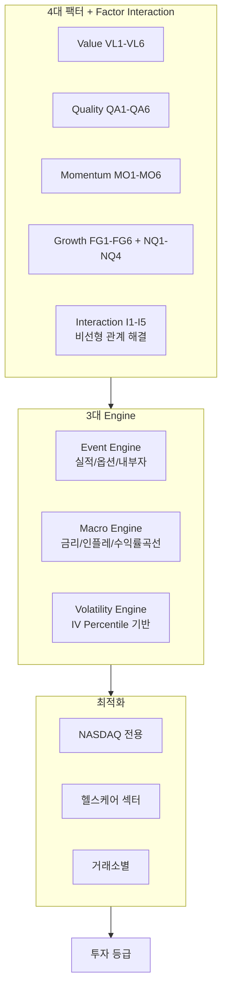

| 구분 | 설명 |
|------|------|
| **Factor Interaction** | Growth x Quality, Growth x Momentum 등 5개 교차항 (Base 70% + Interaction 30%) |
| **Event Engine** | 실적 임박(-5점), Put/Call Ratio, Cluster Buying(+10점) 등 |
| **Macro Engine** | 금리 x 인플레이션 매트릭스, Yield Curve Signal |
| **Volatility Engine** | Factor별 민감도 차등 적용, IV Percentile 기반 조정 |
| **시장 레짐** | AI_BULL, TIGHTENING, RECOVERY, CRISIS, NEUTRAL 5개 레짐 감지 |

### 예측 적중률 추적

퀀트 등급의 실제 성과를 **90일 후 수익률**로 검증하여 모델 신뢰도를 추적합니다.

---

## 포트폴리오 엔진

### 7단계 생성 파이프라인

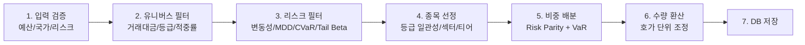

### 9가지 리밸런싱 트리거

| 트리거 | 설명 | 심각도 |
|--------|------|--------|
| **GRADE_DROP** | 퀀트 등급 2단계 이상 하락 | WARNING |
| **STOP_LOSS** | CVaR 기반 동적 손절 | CRITICAL |
| **TRAILING_STOP** | Chandelier Exit (고점 대비 3xATR 하락) | WARNING |
| **SCALE_OUT** | 단계별 익절 (1R, 2R 도달 시 33%씩) | INFO |
| **MDD_LIMIT** | 포트폴리오 MDD 한도 도달 | CRITICAL |
| **SUSPENDED** | 거래 정지 감지 | CRITICAL |
| **MARKET_CRASH** | 벤치마크 급락 시 Tail Beta 가중 대응 | CRITICAL |
| **VAR_LIMIT** | 포트폴리오 VaR 60일 한도 초과 | WARNING |
| **CASH_DRAG** | 유휴 현금 비율 한도 초과 | WARNING |

### 리밸런싱 리포트 에이전트

LangGraph 기반 **3-에이전트 아키텍처**로 리밸런싱 결과를 분석하여 투자자용 리포트를 자동 생성합니다.

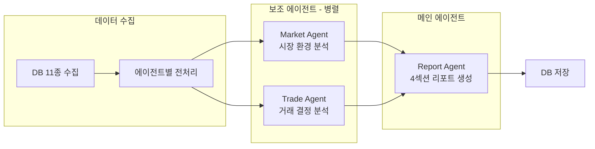

| 섹션 | 내용 | 생성 방식 |
|------|------|----------|
| **Executive Summary** | 헤드라인, 핵심 포인트, 결론, 후속 조치 | LLM |
| **배경** | 트리거 사유, 시장 컨텍스트 | LLM |
| **실행** | 거래 테이블, 매도/매수 결정 상세 | Trade Agent 직접 매핑 (LLM 미사용) |
| **결과** | 리밸런싱 후 상태, 기대 효과, 리스크 | LLM |

### 일일 운영

| 기능 | 설명 |
|------|------|
| **일일 추천 Top 3** | 리스크 레벨별 Top 3 종목 추천 (안정형/균형형/공격형) |
| **자동 리밸런싱** | LIVE 포트폴리오 대상 9가지 트리거 체크 및 자동 실행 |
| **일일 리포트** | 11개 섹션 (성과, 건강/주의/위험 신호, 시장 심리, 등급 변동, 기술적 요약 등) |
| **일일 성과 추적** | 포트폴리오/벤치마크 수익률 비교, 종목별 성과 |

---

## 종목 투자 전략 Multi-Agent

### Task-driven 3-에이전트 아키텍처

> 시스템이 모든 수치를 계산하고, LLM은 해석(narrative)만 생성

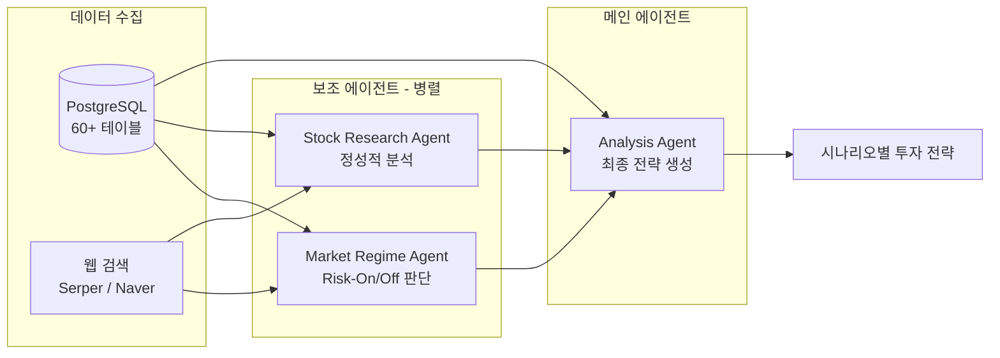

| 에이전트 | 역할 | 입력 | 출력 |
|----------|------|------|------|
| **Market Regime** | 글로벌 시장 환경 분석 | VIX, 달러인덱스, 국채, 금리, 신용스프레드, MOVE | risk_on / risk_off / neutral |
| **Stock Research** | 정성적 분석 | 뉴스, 실적, 내부자거래, 공시 | 리서치 요약 JSON |
| **Analysis** | 최종 투자 전략 생성 | 모든 데이터 + 보조 에이전트 결과 | 시나리오별 완전한 전략 |

### 설계 원칙

| 원칙 | 설명 |
|------|------|
| **Data/Narrative 분리** | 시스템이 data 섹션 계산, LLM이 narrative 섹션만 생성 |
| **검증 루프** | 스키마 + 데이터 일관성 검증, 최대 2회 재시도 |
| **Graceful Degradation** | 보조 에이전트 실패 시에도 메인 플로우 계속 진행 |
| **시장별 적응** | KR(투자자 수급, 네이버 뉴스) / US(옵션 데이터, 내부자거래, sentiment) |

---

## 데이터베이스 스키마

PostgreSQL 기반 **58개+ 테이블**로 구성된 데이터 모델입니다.

### 회원/서비스

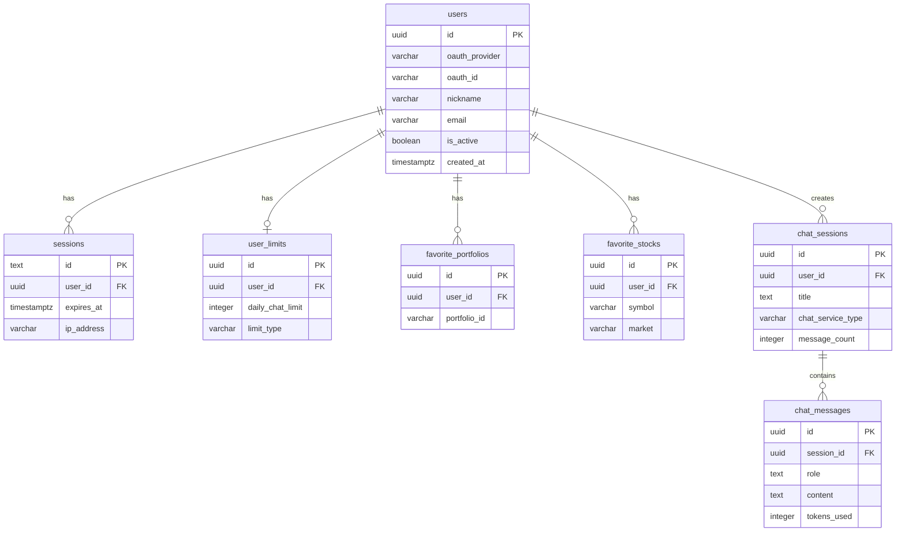

### 한국 주식

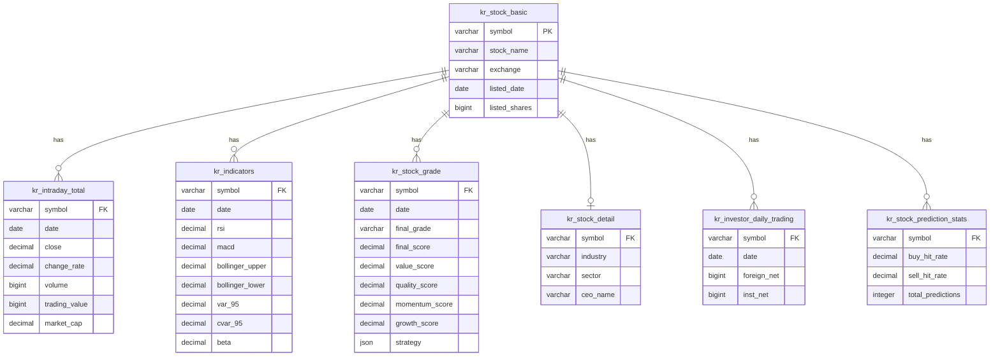

### 미국 주식

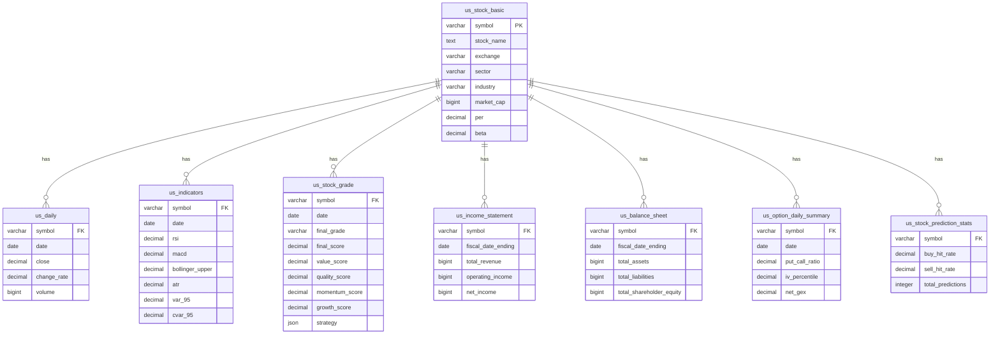

### 포트폴리오

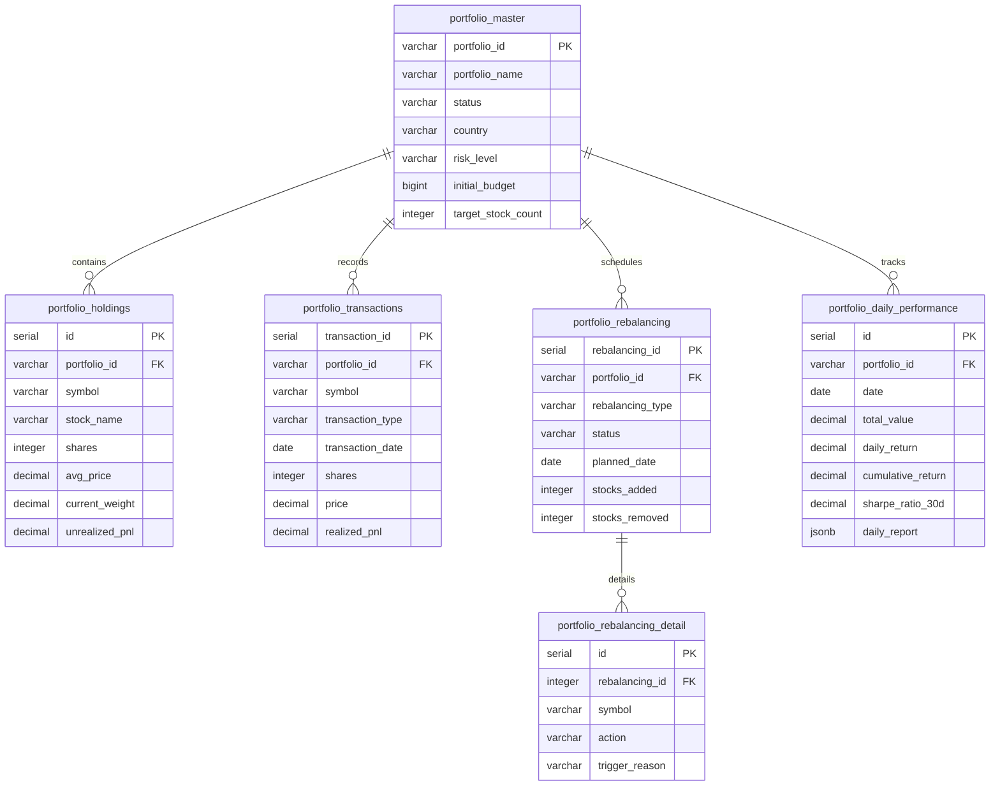

---

## 프로젝트 구조

**떡상**은 8개의 독립적인 저장소로 구성된 멀티레포 아키텍처입니다.

| 저장소 | 설명 | 기술 스택 |
|--------|------|-----------|
| [**overview**](https://github.com/vinjung/alphafolio_overview) | 프로젝트 설명 | - |
| [**client**](https://github.com/vinjung/alphafolio_client) | Frontend (UI/UX) | Next.js 15, React 19, Tailwind CSS 4, Redis |
| [**api**](https://github.com/vinjung/alphafolio_api) | AI 채팅 백엔드 API | FastAPI, LangGraph, ChromaDB, Fine-tuned GPT |
| [**data**](https://github.com/vinjung/alphafolio_data) | 데이터 자동 수집 & 지표 계산 | FastAPI, asyncpg, Cloud Scheduler |
| [**chat**](https://github.com/vinjung/alphafolio_chat) | AI 비서 개발환경 | LangChain, LangGraph, ChromaDB |
| [**quant**](https://github.com/vinjung/alphafolio_quant) | 멀티팩터 퀀트 분석 엔진 | NumPy, SciPy, hmmlearn |
| [**stock_agent**](https://github.com/vinjung/alphafolio_stock_agent) | 종목 투자 전략 Multi-Agent AI | LangGraph, Task-driven Architecture |
| [**portfolio**](https://github.com/vinjung/alphafolio_portfolio) | 포트폴리오 생성 & 리밸런싱 엔진 | Risk Parity, VaR/CVaR, LangGraph |

### 각 저장소별 핵심 기능

<b>client</b> - Frontend

- Next.js 15 App Router + React 19 + Tailwind CSS 4
- Mobile-First PWA, Kakao OAuth 인증
- Redis 기반 시장별 TTL 캐싱 (KR/US 갱신 시점 연동)
- 실시간 SSE 스트리밍 AI 채팅 인터페이스
- 유료회원 전용 콘텐츠 (Stock Agent 전략 생성)
- 일일 추천주 Top 3, 즐겨찾기, 리텐션/UTM 추적

<b>api</b> - AI 채팅 백엔드

- Hybrid Query Router (v3): 룰베이스 4-way 라우팅 (simple/complex/chat/external)
- 16노드 LangGraph 조건부 워크플로우
- Fine-tuned SQL (GPT-4.1-mini, 695개 학습 데이터) + Claude Fallback
- 다층 RAG: Schema RAG + Few-Shot RAG (211개) + Term Mapper (262개)
- 5단계 종목명 해석 (정확→별칭→부분→퍼지→LLM)
- 시장별 지능형 캐싱, 비동기 백그라운드 처리 (Redis Stream)

<b>chat</b> - AI 비서 개발환경

- api 저장소와 동기화되는 개발 환경 (`sync_to_front.sh`)
- v1(직렬) → v2(Query Decomposition) → v3(Hybrid Router) 아키텍처 진화
- Fine-tuning 파이프라인 (데이터 생성 → 분할 → 학습 → 평가)
- ChromaDB 벡터 인덱싱, RAG 재인덱싱 스크립트

<b>data</b> - Data Collector

- 한/미 주식 시장 데이터 자동 수집 (58개+ 테이블)
- Google Cloud Scheduler 기반 6개 정기 스케줄
- KR 13개 + US 13개 일일 작업 (재개 가능한 step 시스템)
- 서비스 체이닝: Data → Quant → Portfolio 자동 연결
- 거래일 자동 판단, API Rate Limiting 대응, 재시도 로직

<b>quant</b> - Quant Engine

- **KR**: 4대 팩터 73개 전략, 19개 시장 상태, IC 기반 동적 가중치
- **US**: Factor Interaction (I1-I5), 3대 Engine (Event/Macro/Volatility), 거래소/섹터별 최적화
- 예측 적중률 추적 시스템 (90일 후 검증)
- 배치 최적화 99.96% 쿼리 감소 (36,400 → 15)
- Railway HTTP 서비스 배포

<b>stock_agent</b> - Multi-Agent AI

- Task-driven V2: Data/Narrative 분리 (LLM 숫자 환각 방지)
- 3-에이전트: Market Regime + Stock Research (병렬) → Analysis Agent
- 검증 루프 (스키마 + 데이터 일관성, 최대 2회 재시도)
- KR/US 시장별 적응 (옵션, 수급, 뉴스 소스 차이)
- FastAPI REST API + Redis Lock (동시 실행 방지)

<b>portfolio</b> - Portfolio Engine

- 7단계 포트폴리오 생성 파이프라인 (Risk Parity, VaR/CVaR/Tail Beta)
- 9가지 트리거 기반 자동 리밸런싱
- LangGraph 3-에이전트 리밸런싱 리포트 (Market + Trade + Report)
- 일일 추천 Top 3 + LIVE 포트폴리오 자동 리밸런싱
- 일일 리포트 v2.0 (11개 섹션)
- 관리자 GUI (Jinja2)

---

## 기술 스택

### Backend

| 구분 | 기술 |
|------|------|
| **Language** | Python 3.12 |
| **Framework** | FastAPI |
| **Database** | PostgreSQL (asyncpg) |
| **Vector DB** | ChromaDB |
| **Cache/Stream** | Redis (3 DB Index: Cache/Task/Stream) |
| **AI Framework** | LangChain 0.3, LangGraph 0.5+ |
| **LLM** | Claude Sonnet 4.5 + Fine-tuned GPT-4.1-mini |

### Frontend

| 구분 | 기술 |
|------|------|
| **Language** | TypeScript 5.0+ |
| **Framework** | Next.js 15 (App Router, Turbopack) |
| **UI Library** | React 19 |
| **State** | Zustand |
| **Styling** | Tailwind CSS 4 |
| **ORM** | Drizzle ORM |

### Infrastructure

| 구분 | 기술 |
|------|------|
| **Hosting** | Railway |
| **Scheduler** | Google Cloud Scheduler |
| **Streaming** | SSE (Redis Stream 기반) |
| **Auth** | Kakao OAuth 2.0 (Arctic) |

### Data Sources

| 소스 | 데이터 |
|------|--------|
| **KRX** | 한국 주식 시세, 투자자 동향, 프로그램 매매, 벤치마크 |
| **DART** | 재무제표, 기업 공시, 배당, 임원, 자사주 |
| **Alpha Vantage** | 미국 주식 시세, 재무제표, 옵션, 뉴스 |
| **FRED** | VIX, MOVE, 달러인덱스, 신용스프레드, GDP, PMI, 금리 |
| **한국은행** | 한국 경제 지표 |
| **Yahoo Finance** | ETF, 보조 시세 데이터 |
| **Finnhub** | 미국 심볼 마스터 |

---

## ⚠️ **사업 코드 - 제한적 공개**

🚫 **상업적 사용 / 수정 / 재배포 엄격 금지**
⏰ **임시 공개 후 Private 전환 예정**
👁️ **참고용으로만 사용하세요**

## License
[CC BY-NC-ND 4.0](https://creativecommons.org/licenses/by-nc-nd/4.0/)
